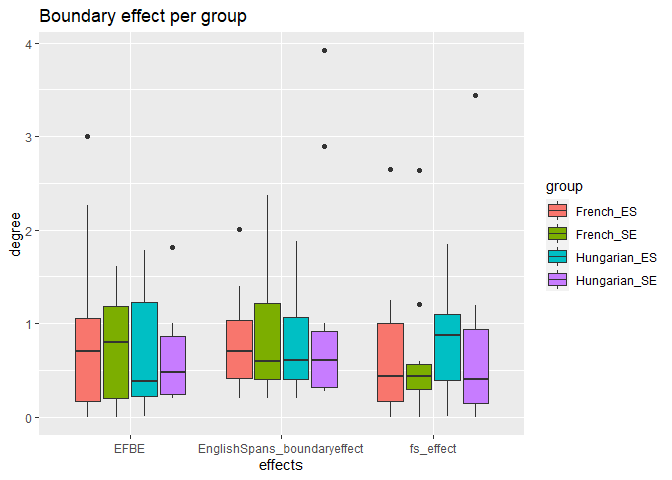
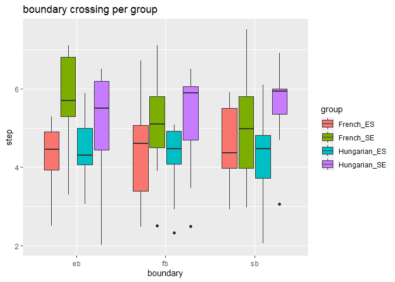

Plots
================

``` r
library(tidyverse)
```

    ## -- Attaching packages --------------------------------------- tidyverse 1.3.0 --

    ## v ggplot2 3.3.2     v purrr   0.3.4
    ## v tibble  3.0.4     v dplyr   1.0.2
    ## v tidyr   1.1.2     v stringr 1.4.0
    ## v readr   1.4.0     v forcats 0.5.0

    ## -- Conflicts ------------------------------------------ tidyverse_conflicts() --
    ## x dplyr::filter() masks stats::filter()
    ## x dplyr::lag()    masks stats::lag()

``` r
#load in group data

all_seh = read.csv("data/all_seh.csv")
all_sef = read.csv("data/all_sef.csv")
all_esf = read.csv("data/all_esf.csv")
all_esh = read.csv("data/all_esh.csv")

all_se = rbind(all_sef, all_seh, all_esf, all_esh)

glimpse(all_se)
```

    ## Rows: 53
    ## Columns: 12
    ## $ X.1                         <int> 1, 2, 3, 4, 5, 6, 7, 8, 9, 10, 11, 12, ...
    ## $ X                           <int> 1, 1, 1, 1, 1, 1, 1, 1, 1, 1, 1, 1, 1, ...
    ## $ eb                          <dbl> 7.064026, 7.019211, 5.299296, 4.698141,...
    ## $ sb                          <dbl> 4.693214, 6.500000, 4.900909, 3.065019,...
    ## $ fb                          <dbl> 5.899607, 6.900184, 5.099079, 5.699414,...
    ## $ EFBE                        <dbl> 1.1644190017, 0.1190265093, 0.200216870...
    ## $ EnglishSpans_boundaryeffect <dbl> 2.3708125, 0.5192106, 0.3983870, 1.6331...
    ## $ prolific_id                 <chr> "5f2f0ce447c28c13b4644609", "5eb0cb5afb...
    ## $ participantid               <chr> "sef1", "sef2", "sef3", "sef5", "sef7",...
    ## $ group                       <chr> "SE", "SE", "SE", "SE", "SE", "SE", "SE...
    ## $ L3group                     <chr> "French", "French", "French", "French",...
    ## $ fs_effect                   <dbl> 1.2063935344, 0.4001840700, 0.198170092...

``` r
## if participants have 
model = glm(all_se$fs_effect ~ all_se$EnglishSpans_boundaryeffect)

model2 = glm(all_se$fs_effect ~ all_se$L3group + all_se$group)

summary(model)
```

    ## 
    ## Call:
    ## glm(formula = all_se$fs_effect ~ all_se$EnglishSpans_boundaryeffect)
    ## 
    ## Deviance Residuals: 
    ##     Min       1Q   Median       3Q      Max  
    ## -0.9257  -0.3143  -0.1572   0.1223   1.8790  
    ## 
    ## Coefficients:
    ##                                    Estimate Std. Error t value Pr(>|t|)    
    ## (Intercept)                          0.1738     0.1228   1.415    0.163    
    ## all_se$EnglishSpans_boundaryeffect   0.5754     0.1086   5.300  2.5e-06 ***
    ## ---
    ## Signif. codes:  0 '***' 0.001 '**' 0.01 '*' 0.05 '.' 0.1 ' ' 1
    ## 
    ## (Dispersion parameter for gaussian family taken to be 0.3293127)
    ## 
    ##     Null deviance: 26.046  on 52  degrees of freedom
    ## Residual deviance: 16.795  on 51  degrees of freedom
    ## AIC: 95.499
    ## 
    ## Number of Fisher Scoring iterations: 2

``` r
summary(model2)
```

    ## 
    ## Call:
    ## glm(formula = all_se$fs_effect ~ all_se$L3group + all_se$group)
    ## 
    ## Deviance Residuals: 
    ##     Min       1Q   Median       3Q      Max  
    ## -0.8147  -0.5294  -0.1536   0.2531   2.7048  
    ## 
    ## Coefficients:
    ##                         Estimate Std. Error t value Pr(>|t|)    
    ## (Intercept)              0.64184    0.15977   4.017 0.000198 ***
    ## all_se$L3groupHungarian  0.17599    0.19933   0.883 0.381489    
    ## all_se$groupSE          -0.08593    0.19647  -0.437 0.663737    
    ## ---
    ## Signif. codes:  0 '***' 0.001 '**' 0.01 '*' 0.05 '.' 0.1 ' ' 1
    ## 
    ## (Dispersion parameter for gaussian family taken to be 0.5111254)
    ## 
    ##     Null deviance: 26.046  on 52  degrees of freedom
    ## Residual deviance: 25.556  on 50  degrees of freedom
    ## AIC: 119.75
    ## 
    ## Number of Fisher Scoring iterations: 2

``` r
## testing models
model = glm(all_se$fs_effect ~ all_se$EnglishSpans_boundaryeffect)

model2 = glm(all_se$fs_effect ~ all_se$L3group + all_se$group)

summary(model)
```

    ## 
    ## Call:
    ## glm(formula = all_se$fs_effect ~ all_se$EnglishSpans_boundaryeffect)
    ## 
    ## Deviance Residuals: 
    ##     Min       1Q   Median       3Q      Max  
    ## -0.9257  -0.3143  -0.1572   0.1223   1.8790  
    ## 
    ## Coefficients:
    ##                                    Estimate Std. Error t value Pr(>|t|)    
    ## (Intercept)                          0.1738     0.1228   1.415    0.163    
    ## all_se$EnglishSpans_boundaryeffect   0.5754     0.1086   5.300  2.5e-06 ***
    ## ---
    ## Signif. codes:  0 '***' 0.001 '**' 0.01 '*' 0.05 '.' 0.1 ' ' 1
    ## 
    ## (Dispersion parameter for gaussian family taken to be 0.3293127)
    ## 
    ##     Null deviance: 26.046  on 52  degrees of freedom
    ## Residual deviance: 16.795  on 51  degrees of freedom
    ## AIC: 95.499
    ## 
    ## Number of Fisher Scoring iterations: 2

``` r
summary(model2)
```

    ## 
    ## Call:
    ## glm(formula = all_se$fs_effect ~ all_se$L3group + all_se$group)
    ## 
    ## Deviance Residuals: 
    ##     Min       1Q   Median       3Q      Max  
    ## -0.8147  -0.5294  -0.1536   0.2531   2.7048  
    ## 
    ## Coefficients:
    ##                         Estimate Std. Error t value Pr(>|t|)    
    ## (Intercept)              0.64184    0.15977   4.017 0.000198 ***
    ## all_se$L3groupHungarian  0.17599    0.19933   0.883 0.381489    
    ## all_se$groupSE          -0.08593    0.19647  -0.437 0.663737    
    ## ---
    ## Signif. codes:  0 '***' 0.001 '**' 0.01 '*' 0.05 '.' 0.1 ' ' 1
    ## 
    ## (Dispersion parameter for gaussian family taken to be 0.5111254)
    ## 
    ##     Null deviance: 26.046  on 52  degrees of freedom
    ## Residual deviance: 25.556  on 50  degrees of freedom
    ## AIC: 119.75
    ## 
    ## Number of Fisher Scoring iterations: 2

``` r
mean_se = mean(all_se$EnglishSpans_boundaryeffect)
sd_se = sd(all_se$EnglishSpans_boundaryeffect)

t.test(all_se$eb, all_se$sb, paired = TRUE,)
```

    ## 
    ##  Paired t-test
    ## 
    ## data:  all_se$eb and all_se$sb
    ## t = 0.70027, df = 52, p-value = 0.4869
    ## alternative hypothesis: true difference in means is not equal to 0
    ## 95 percent confidence interval:
    ##  -0.2039356  0.4225695
    ## sample estimates:
    ## mean of the differences 
    ##               0.1093169

``` r
eb = mean(all_se$eb)
sb = mean(all_se$sb)
```

``` r
##tidy data

all_se_tidy = all_se %>% 
  pivot_longer(c(`eb`, `sb`, `fb`), names_to = "boundary", values_to = "step")

all_se_tidy2 = all_se %>% 
  pivot_longer(c(`EFBE`, `fs_effect`, `EnglishSpans_boundaryeffect`), names_to = "effects", values_to = "degree")

all_se_tidy3 = unite_(all_se_tidy2, "group", c("L3group","group"))

all_se_tidy = unite_(all_se_tidy, "group", c("L3group","group"))

## look at the L3 span boundary effect per group and order

ggplot(all_se_tidy3, aes(x = effects, y = degree, fill = group)) + geom_boxplot() + ggtitle("Boundary effect per group")
```

<!-- -->

``` r
ggplot(all_se_tidy, aes(x = boundary, y = step, fill = group)) + geom_boxplot() + ggtitle("boundary crossing per group")
```

<!-- -->

``` r
## T test to see if the differences in ES L3 groups are significant

t.test(all_esf$fs_effect, all_esh$fs_effect)
```

    ## 
    ##  Welch Two Sample t-test
    ## 
    ## data:  all_esf$fs_effect and all_esh$fs_effect
    ## t = -0.75959, df = 24.132, p-value = 0.4549
    ## alternative hypothesis: true difference in means is not equal to 0
    ## 95 percent confidence interval:
    ##  -0.6703285  0.3095822
    ## sample estimates:
    ## mean of x mean of y 
    ## 0.6400516 0.8204248
