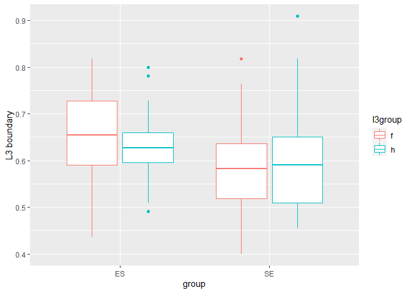
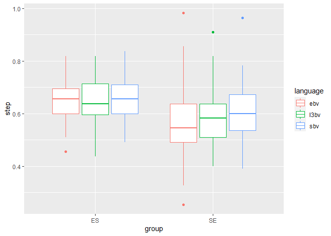
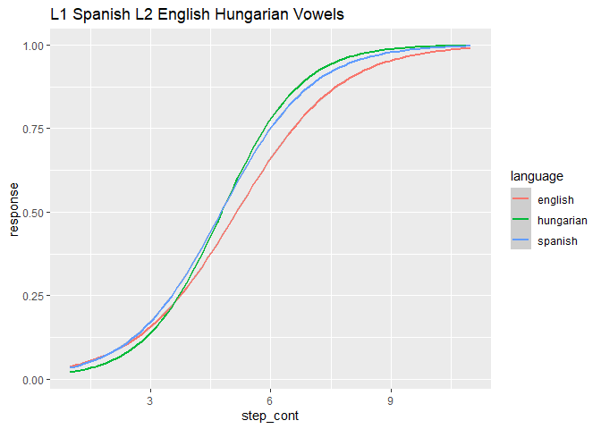
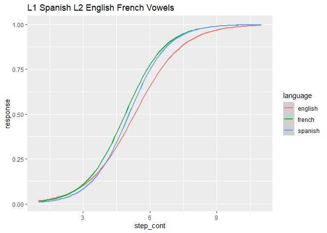
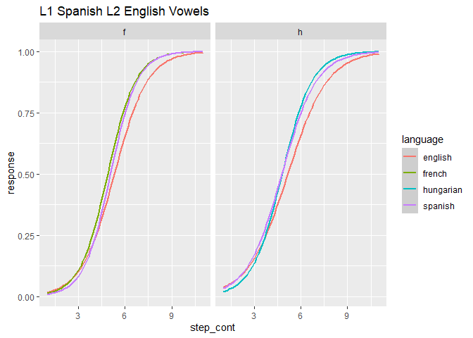
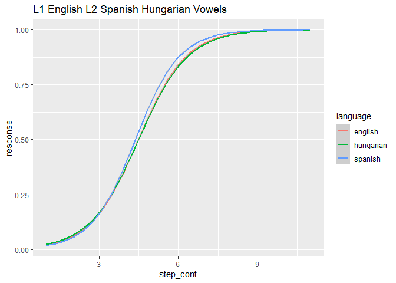
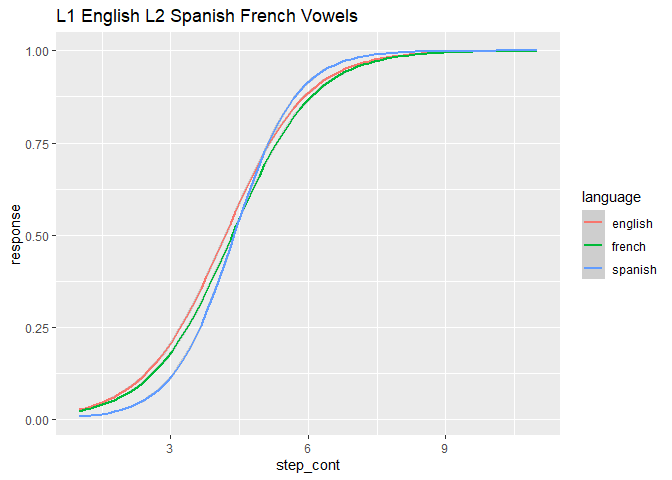
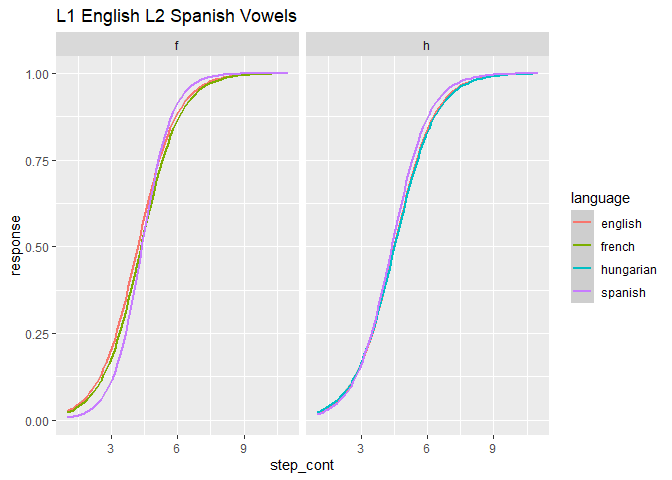

Preliminary Results
================

## Overview

Here I will briefly show the results of the 2afc task by 4 groups,
including both orders of acquisition (Spanish-English and
English-Spanish) who were told that they were hearing either French or
Hungarian (the variable L3 group).

**Note** for the boundaries, I calculated the mean responses (from 0-1),
rather than using the cross-over function, due to lack of ability. I
also used this as exclusion criteria; if a participant has a response
average over .9 they were omitted, since this means they probably hit
the same button most of the time and did not pay attention.

A total of 75 completed all portions of the experiment, and met the
eligibility criteria for the study. There were a total of 16
English-Spanish bilinguals assigned to the French group, and 16 assigned
to the Hungarian group. 19 Spanish-English bilinguals were assigned to
the French group and 24 were assigned to the Hungarian group.

## L1-L2 Vowels: the double phonemic boundary

The results of the present study found a double phonemic boundary
between the vowels /i/ and /u/ in the Spanish-English group, but not the
English-Spanish group. In order to establish which perceptual boundary
the participants use when they encounter speech in a new language, it is
first important to replicate previous studies that have demonstrated
double-phonemic boundary effects in bilinguals. Of course, the presence
of two boundaries is a prerequisite to answer the questions posed by the
present study. As a result, the results of the ES group are essentially
null, in that they did not show a double phonemic boundary, and it
cannot be determined which of their two languages they employ when they
encounter L3 speech. On the other hand, evidence was found for a double
phonemic boundary the SE group, which allows for the comparison of this
group’s boundaries to their L3 categorizations. In order to determine
whether both groups show evidence of a double phonemic boundary, paired
T-tests were carried out.

## T-tests for L1-L2 vowels

**Paired T-test for the ES group’s L1-L2 vowel categorization**

    ## 
    ##  Paired t-test
    ## 
    ## data:  es_descriptive$ebv and es_descriptive$sbv
    ## t = 0.25535, df = 31, p-value = 0.8001
    ## alternative hypothesis: true difference in means is not equal to 0
    ## 95 percent confidence interval:
    ##  -0.02382007  0.03063825
    ## sample estimates:
    ## mean of the differences 
    ##             0.003409091

**Paired T-test for the SE group’s L1-L2 vowel categorization**

    ## 
    ##  Paired t-test
    ## 
    ## data:  se_descriptive$ebv and se_descriptive$sbv
    ## t = -3.6659, df = 40, p-value = 0.0007164
    ## alternative hypothesis: true difference in means is not equal to 0
    ## 95 percent confidence interval:
    ##  -0.08289718 -0.02397643
    ## sample estimates:
    ## mean of the differences 
    ##             -0.05343681

## T-tests for L1-L2 stops

**Paired T-test for the ES group’s L1-L2 stop categorization**

    ## 
    ##  Paired t-test
    ## 
    ## data:  es_descriptive_s$ebs and es_descriptive_s$sbs
    ## t = -1.0435, df = 31, p-value = 0.3048
    ## alternative hypothesis: true difference in means is not equal to 0
    ## 95 percent confidence interval:
    ##  -0.06082786  0.01965139
    ## sample estimates:
    ## mean of the differences 
    ##             -0.02058824

**Paired T-test for the SE group’s L1-L2 stop categorization**

    ## 
    ##  Paired t-test
    ## 
    ## data:  se_descriptive_s$ebs and se_descriptive_s$sbs
    ## t = -2.1654, df = 42, p-value = 0.03609
    ## alternative hypothesis: true difference in means is not equal to 0
    ## 95 percent confidence interval:
    ##  -0.058144496 -0.002047022
    ## sample estimates:
    ## mean of the differences 
    ##             -0.03009576

## Plots

Plots show the s-shaped curves of the responses by group. The x-axis
shows the step in the continuum and the y axis shows the percentage
response either /p/ for stops or /u/ for vowels.

#### Plot L3 boundaries by order of acquisition

<!-- -->

#### Plot boundary per language per group

<!-- -->

### Plot S-shaped curves per group

#### SEH vowels

    ## `geom_smooth()` using formula 'y ~ x'

<!-- -->

#### SEF vowels

    ## `geom_smooth()` using formula 'y ~ x'

<!-- -->

#### Facet SE group by l3 group

    ## `geom_smooth()` using formula 'y ~ x'

<!-- -->

#### ESH vowels

    ## `geom_smooth()` using formula 'y ~ x'

<!-- -->

#### ESF vowels

    ## `geom_smooth()` using formula 'y ~ x'

<!-- -->

#### Facet ES group by l3 group

    ## `geom_smooth()` using formula 'y ~ x'

<!-- -->
